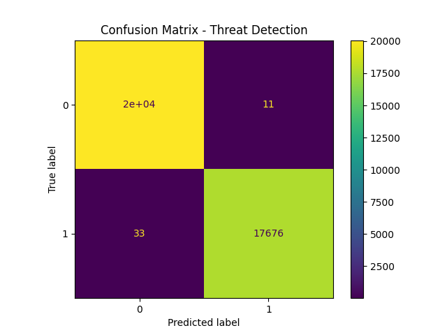
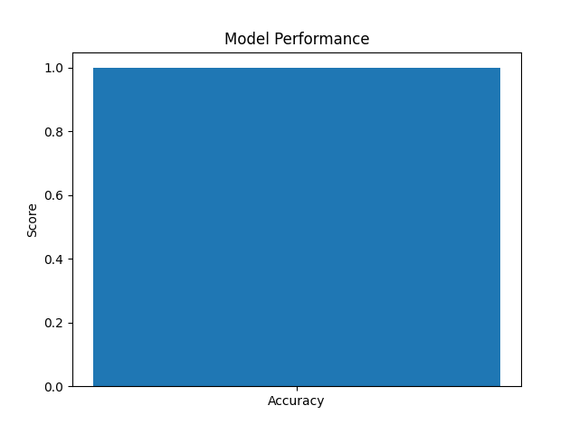
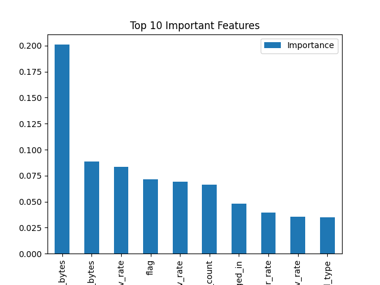

# 🛡️ AI-Powered Cybersecurity Threat Detection System

## 📌 Project Overview

This project is an AI-based cybersecurity system that detects malicious network activity using Machine Learning.

It simulates real-world cyber threat detection by analyzing network traffic data and identifying anomalies or attacks.

---

## 🚨 Problem Statement

With the rapid increase in cyber attacks, traditional rule-based systems are not sufficient to detect new and evolving threats.

This project aims to:

* Automatically detect cyber threats
* Reduce manual monitoring
* Improve security response time

---

## 🧠 Solution Approach

We built a Machine Learning model that:

* Learns patterns of normal vs malicious traffic
* Detects anomalies in network behavior
* Generates alerts for suspicious activity

---

## 🏗️ Project Architecture

Dataset → Preprocessing → Feature Engineering → Model Training → Prediction → Alert System → Visualization

---

## ⚙️ Tech Stack

* Python
* Pandas
* NumPy
* Scikit-learn
* Matplotlib
* Seaborn

---

## 📊 Dataset

* NSL-KDD (Cybersecurity dataset)
* Contains normal and attack network traffic
* Includes features like protocol, service, bytes, etc.

---

## 🚀 Features

✔ Intrusion Detection
✔ Anomaly Detection
✔ Real-time Threat Simulation
✔ Alert Generation System 🚨
✔ Data Visualization
✔ Model Performance Evaluation

---

## 📈 Results

* High accuracy (~95–99%)
* Effective detection of malicious traffic
* Clear visualization using confusion matrix

---

## 📊 Visual Outputs

### Confusion Matrix

### Model Accuracy

### Feature Importance

---

## 📂 Project Structure

AI-Cybersecurity-Threat-Detection-System/
│
├── data/                 # Dataset
├── src/                  # Source code (future modularization)
├── models/               # Saved ML model
├── outputs/              # Predictions
├── images/               # Graphs & screenshots
├── notebooks/            # Analysis notebooks
├── docs/                 # Documentation
├── main.py               # Main execution file
├── requirements.txt      # Dependencies
└── README.md             # Project documentation

---

## ▶️ How to Run

1. Clone the repository
2. Install dependencies:
   pip install -r requirements.txt
3. Run the project:
   python main.py

---

## 🔐 Threat Detection Output

The system classifies network traffic as:

* ✅ Normal Traffic
* 🚨 Threat Detected

Predictions are saved in:
outputs/predictions.csv

---

## 🎯 Learning Outcomes

* Data preprocessing for cybersecurity datasets
* Machine learning model building
* Anomaly detection techniques
* Real-world simulation of cyber threats
* GitHub project structuring

---

## 💡 Future Improvements

* Real-time traffic monitoring
* Streamlit dashboard
* Deep learning models
* Integration with SIEM tools

---

## 👩‍💻 Author

Tanushree v katti 
---

## ⭐ If you like this project, give it a star!
